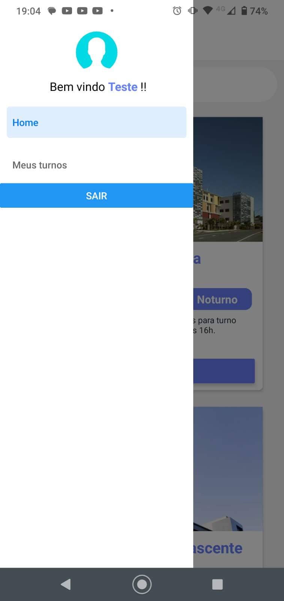
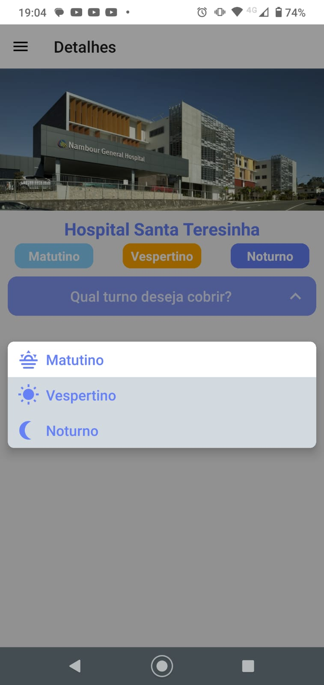
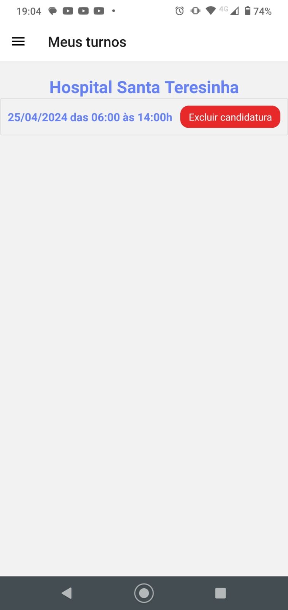

<!-- PROJECT LOGO -->
<br />
<p align="center">
 <h3 align="center">Projeto HealthShift</h3>
 <br>
</p>

## Sobre o Projeto

Este projeto visa a criação de um aplicativo para unir instituições de saúde com profissionais de enfermagem, facilitando o planejamento e candidatura para os turnos disponiveis em cada instituição.

### Feito Com

Abaixo segue o que foi utilizado na criação deste projeto:

- [React Native](http://facebook.github.io/react-native/) - O React Native é um framework que permite o desenvolvimento de aplicações mobile usando JavaScript e React;
- [React Navigation](https://reactnavigation.org/) - O React Navigation surgiu da necessidade da comunidade do React Native de uma navegação de forma fácil de se usar e escrita toda em JavaScript;
- [React Native Gesture Handler](https://kmagiera.github.io/react-native-gesture-handler/) - API declarativa que permite a manipulação de toques e gestos no React Native;
- [Babel](https://babeljs.io/) - O Babel é um compilador JavaScript gratuito e de código aberto e transpiler configurável usado no desenvolvimento de aplicações JavaScript;
  - [babel-eslint](https://github.com/babel/babel-eslint) - Este pacote é um _wrapper_ do parser do Babel para o ESLint;
  - [babel-plugin-root-import](https://github.com/entwicklerstube/babel-plugin-root-import) - Esse plugin do Babel permite que sejam feitos imports e requires em caminhos baseados em uma raiz(root);
- [Expo](https://github.com/expo/expo/) - Expo é um framework open source para criação de apps nativos com React.


### Pré-requisitos

Antes de seguirmos para as configurações e uso do projeto, é ideal que você tenha o ambiente configurado para criar e testar aplicativos em React Native, para isso você pode seguir o guia do link abaixo:

[Docs Expo](https://docs.expo.dev/)

### Estrutura de Arquivos

A estrutura de arquivos está da seguinte maneira:

```bash
├── src/
│   ├── assets/
│   │   └── adaptive-icon.png
│   │   └── favicon.png
│   │   └── HealthShift.png
│   │   └── icon.png
│   │   └── perfil.png
│   │   └── spash.png
│   ├── contexts/
│   │   └── authContext.js
│   │   └── shiftContext.js
│   ├── custom/
│   │   ├── cards/
│   │       └── authContext.js
│   │   ├── drawer/
│   │       └── customDrawer.js
│   │   ├── select/
│   │        └── select.js
│   │   ├── shifts/
│   │        └── shifts.js
│   ├── mock/
│   │   └── Unidades.js
│   ├── routes/
│   │   └── app.routes.js
│   │   └── auth.routes.js
│   │   └── index.js
│   ├── screens/
│   │   ├── Detail/
│   │        └── components/
│   │            └── unityImage.js
│   │       └── customDrawer.js
│   │   ├── Home/
│   │        └── components/
│   │            └── unidadeCard.js
│   │       └── home.js
│   │   ├── Login/
│   │        └── components/
│   │            └── formLogin.js
│   │            └── formRegister.js
│   │       └── login.js
│   │   ├── Turnos/
│   │       └── turnos.js
│   ├── services/
│   │   └── firebase.js
│   │   └── globalstorage.js
│   ├── themes/
│   │   └── basedThemes.js
│   ├── utils/
│   │   └── checkColor.js
│   │   └── formatDate.js
│   ├── validators/
│   │   ├── errors/
│   │       └── errors.js
│   │   └── authValidators.js
│   │   └── checkColor.js
│   │   └── formatDate.js
├── .gitignore
├── App.js
├── app.json
├── babel.config.js
├── package-lock.json
├── package.json
```

### Edição

Nesta seção haverão instruções estruturais, explicando para que os diretórios são utilizados e também os arquivos de configuração.

- **src** - Diretório contendo todos os arquivos da aplicação, é criado um diretório `src` para que o código da aplicação possa ser isolado em um diretório e facilmente portado para outros projetos, se necessário;

  - **assets** - Diretório para armazenar imagens em geral que possam ser utilizadas na aplicação.

  - **contexts** - Diretório para armazenamento de contextos da aplicação.

  - **custom** - Diretório para armazenamento dos componentes customizados de bibliotecas externas, que serão utilizados na aplicação.

  - **mock** - Diretório para armazenamento dos dados exemplo que serão utilizados na aplicação, simulando requisições HTTP e banco de dados.

  - **routes** - Diretório para armazenamento das configurações rotas da aplicação.

  - **screens** - Diretório para armazenamento dos componentes principais da aplicação.

  - **services** - Diretório para armazenamento dos serviços da aplicação, separando responsabilidades de outros componentes.
  - **themes** - Diretório para armazenamento das configurações de tema da aplicação, como cores padrão.

  - **utils** - Diretório para armazenamento de funções auxiliares que serão utilizadas em toda a aplicação.

  - **validators** - Diretório para armazenamento de validações com lógica de negócio e erros comuns da aplicação.

- **.gitignore** - Arquivo para evitar versionamento de arquivos não necessários para a cada ambiente de desenvolvimento, como ambientes de IDE e módulos do npm
- **App.js** - Arquivo raiz da aplicação, também chamado de _Entry Point_, é o primeiro arquivo chamado no momento do build e execução da aplicação.

- **app.json** - Arquivo de configuração da aplicação.

- **babel.config.js** - Arquivo de configuração do Babel, é nele que é configurado o Babel Plugin Root Import para aceitar imports absolutos na aplicação usando o diretório `src` como raiz;

- **package.json** - Diferente dos projetos comuns, esse arquivo tem as configurações necessárias para a publicação do Template no NPM, para saber mais sobre isso veja a seção abaixo.

## Contribuição

Contribuições são o que fazem a comunidade open source um lugar incrível para aprender, inspirar e criar. Qualquer contribuição que você fizer será **muito apreciada**.

1. Faça um Fork do projeto
2. Crie uma Branch para sua Feature (`git checkout -b feature/FeatureIncrivel`)
3. Adicione suas mudanças (`git add .`)
4. Comite suas mudanças (`git commit -m 'Adicionando uma Feature incrível!`)
5. Faça o Push da Branch (`git push origin feature/FeatureIncrivel`)
6. Abra um Pull Request

## Contato

Vinícius - **vini383@gmail.com**

## ScreenShots

<div style="text-align:center;">










</div>


